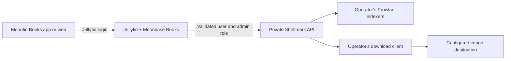

# Moonbase Books

Moonbase Books is a fork of [Moonfin-Client/Plugin](https://github.com/Moonfin-Client/Plugin). Its Jellyfin plugin adds an authenticated Books bridge and serves the matching [Moonfin Books](https://github.com/ZepiGit/Moonfin-Books) web app. Users search for ebooks or audiobooks, choose a release, queue a download, and view their own status from the existing Jellyfin session.

The Jellyfin controller exposes five Books operations: `Status`, `Search`, `Releases`, `Download`, and `Active`. It derives `Remote-User` and `Remote-Groups` from validated Jellyfin identity claims; client-supplied identity headers, cookies, and tokens are not forwarded to Shelfmark. The `admins` group is sent only for a validated Jellyfin administrator. Status is scoped to the caller. Release jobs are user bound, and source IDs are returned as opaque, expiring, user-bound handles. Keep the plugin's persistent data-protection keyring backed up and private.

Only the Shelfmark Prowlarr release adapter is currently allowed through this Books API. Shelfmark still needs the operator's own Prowlarr indexers, downloader, and import paths. See [Server setup](docs/SERVER_SETUP.md) for a concrete configuration and verification sequence.

## Compatibility and installation

The Books backend version `2.3.1.0` passed 135 smoke checks and was tested with Jellyfin `12.1` and Shelfmark `1.3.15`. Other combinations need independent validation. Upstream Moonbase has Emby features, but **this Books bridge is not available for Emby yet**.

Install the Jellyfin artifact from this fork's build as a **replacement** for official Moonbase. It retains the upstream Jellyfin assembly name and plugin GUID, so the two builds must not be installed side by side. Preserve the existing plugin configuration before replacement and keep only one Moonfin Server assembly in the active plugins directory. The custom package metadata sets `autoUpdate: false`; update this fork deliberately after checking compatibility.

The web app is served by the plugin at `https://jellyfin.example.org/Moonfin/Web/`. A separate browser login is not needed after signing in to Moonfin Books. Existing native Moonfin apps do not gain the new page through a plugin update alone.

## Web screenshots

These images show the **finished web build** included with the plugin. The narrow view is a responsive browser capture, not a native phone or TV screenshot.

| Desktop web | Narrow responsive web |
| --- | --- |
|  |  |

## Build from source

The exact CI entry point is [`.github/workflows/books-plugin.yml`](.github/workflows/books-plugin.yml). Its `APPS_SOURCE_REF` pins the reviewed Moonfin Books commit for reproducible plugin/web packaging. The workflow runs the Books backend smoke checks, builds that exact app revision for web, then invokes `Jellyfin/build.sh` and `scripts/package-books.py` to produce the Jellyfin ZIP and checksum. It uploads CI artifacts and does not create a public release.

## License and upstream

Moonbase Books retains the GNU GPL version 3 license and upstream notices from [Moonfin-Client/Plugin](https://github.com/Moonfin-Client/Plugin). See [LICENSE](LICENSE) and the preserved [upstream README](README.upstream.md). This fork is separate from official Moonbase releases.
