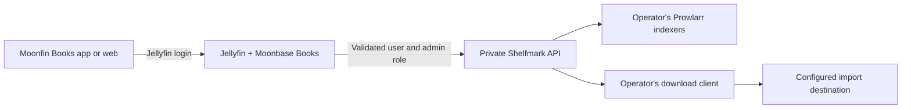
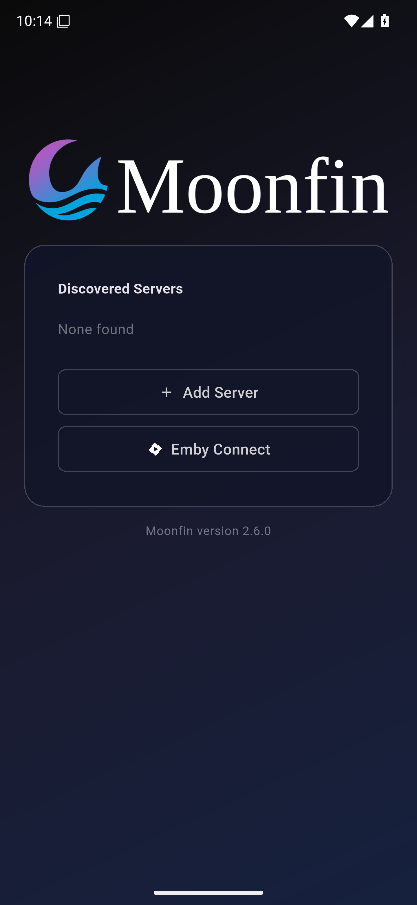

# Moonbase Books

Moonbase Books is a fork of [Moonfin-Client/Plugin](https://github.com/Moonfin-Client/Plugin). Its Jellyfin plugin adds an authenticated Books bridge and serves the matching [Moonfin Books](https://github.com/ZepiGit/Moonfin-Books) web app. Users search for ebooks or audiobooks, choose a release, queue a download, and view their own status from the existing Jellyfin session.

The Jellyfin controller exposes five Books operations: `Status`, `Search`, `Releases`, `Download`, and `Active`. It derives `Remote-User` and `Remote-Groups` from validated Jellyfin identity claims; client-supplied identity headers, cookies, and tokens are not forwarded to Shelfmark. The `admins` group is sent only for a validated Jellyfin administrator. Status is scoped to the caller. Release jobs are user bound, and source IDs are returned as opaque, expiring, user-bound handles. Keep the plugin's persistent data-protection keyring backed up and private.

Only the Shelfmark Prowlarr release adapter is currently allowed through this Books API. Shelfmark still needs the operator's own Prowlarr indexers, downloader, categories, and persistent import paths. See [Server setup](docs/SERVER_SETUP.md) for a concrete configuration and verification sequence.

## Compatibility and installation

Moonbase Books `2.3.1.100` passed 135 backend smoke checks, 14 Shelfmark regression tests and 17 live API checks on [Jellyfin `12.1`](https://github.com/jellyfin/jellyfin/releases/tag/v12.1) with [Shelfmark Lite `1.3.15`](https://github.com/calibrain/shelfmark/releases/tag/v1.3.15). The exact release ZIP was deployed successfully, and a regular user completed web search and release selection without an external page or another login. These tests do not certify other server versions. Upstream Moonbase has Emby features, but **this Books bridge is not available for Emby yet**.

Install the Jellyfin artifact from this fork as a **replacement** for official Moonbase. It retains the upstream Jellyfin assembly name and plugin GUID, so the two plugins cannot coexist. Back up the plugin files, configuration, and Books keyring; remove the official Moonbase repository entry from Jellyfin before replacement. `autoUpdate: false` in the fork package is not enough to prevent the old catalog from offering an upstream replacement. No Moonbase Books updater catalog is published currently; install future updates deliberately after checking compatibility.

The web app is served by the plugin at `https://jellyfin.example.org/Moonfin/Web/` and includes Books. Official native Moonfin apps continue using their normal Moonbase features on this server, but do not gain the Books tab through a plugin update. Install a [Moonfin Books native fork package](https://github.com/ZepiGit/Moonfin-Books/blob/main/docs/INSTALL.md) for that tab; the fork's app-local data is separate from official Moonfin. [Download Preview 1](https://github.com/ZepiGit/Moonbase-Books/releases/tag/v2.3.1.100-books.1) for the verified ZIP, checksums and exact source revisions. Start with the [step-by-step server setup guide](docs/SERVER_SETUP.md).

## Web screenshots

These images show the **finished web build** included with the plugin. The narrow view is a responsive browser capture, not a native phone or TV screenshot.

| Desktop web | Narrow responsive web |
| --- | --- |
|  |  |

## Build from source

The exact CI entry point is [`.github/workflows/books-plugin.yml`](.github/workflows/books-plugin.yml). Its `APPS_SOURCE_REF` pins the reviewed Moonfin Books commit for reproducible plugin/web packaging. The workflow runs the Books backend smoke checks, builds that exact app revision for web, then invokes `Jellyfin/build.sh` and `scripts/package-books.py` to produce the Jellyfin ZIP and checksum. It uploads CI artifacts and does not create a public release.

## License and upstream

Moonbase Books retains the GNU GPL version 3 license and upstream notices from [Moonfin-Client/Plugin](https://github.com/Moonfin-Client/Plugin). See [LICENSE](LICENSE) and the preserved [upstream README](README.upstream.md). This fork is separate from official Moonbase releases.

## Native client startup evidence

The matching release-signed Moonfin Books Android APK reached server selection in an Android 15 emulator. This verifies native startup; the Books search screenshots above show the plugin-served web build. Physical Android Books requests and playback have not been tested.

